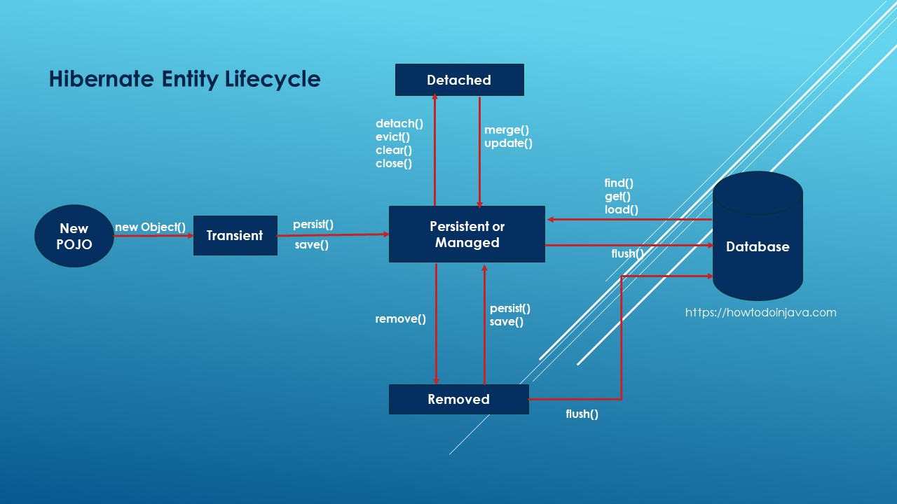
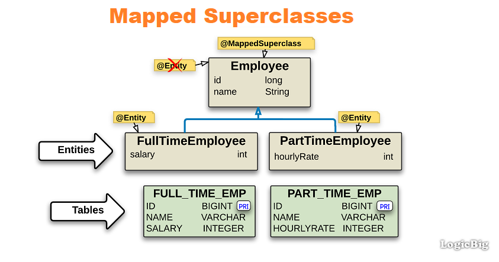
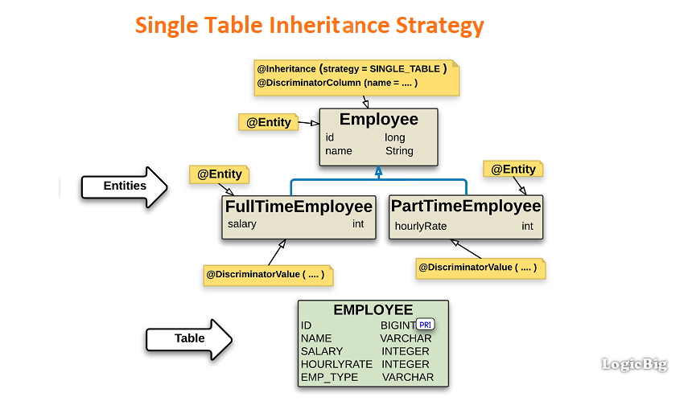
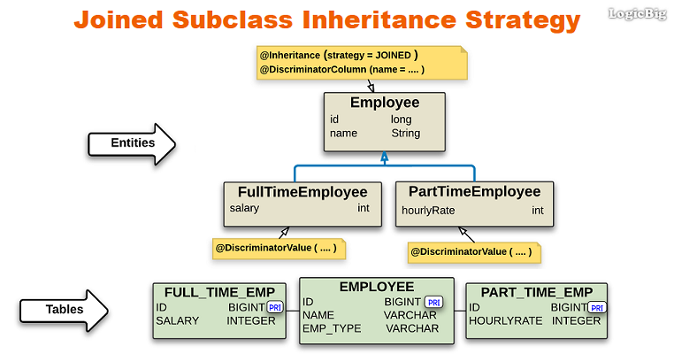

# Hibernate knowledge
## Core
### Persistence Context

A persistence context is a set of entity instances. Within the persistence context, the entity instances and their lifecycle are managed.

<details>
  <summary></summary>
  <br/>
  
  
  
</details>

<details>
  <summary>Persistent Context and Session</summary>
  <br/>
  
  
  
</details>

### Entity lifecycle

<details>
  <summary>Overview</summary>
  <br/>
  
  
  
</details>

### Automatic dirty checking
### Inheritance

Inheritance is one of the most important of object-oriented principles. But the relational databases do not support inheritance. Hibernate’s Inheritance Mapping strategies deal with this issue.

<details>
  <summary>Types of inheritance strategy</summary>
  <br/>
  
  + MappedSuperclass – the parent classes, can't be entities
  + Single Table – The entities from different classes are placed in a single table.
  + Joined Table – Each class has its table, and querying a subclass entity requires joining the tables.
  + Table per Class – All the properties of a class are in its table, so no join is required.
  
  Ref: https://www.baeldung.com/hibernate-inheritance
  
</details>
<details>
  <summary>MappedSuperclass</summary>
  <br/>
  
  
  
</details>
<details>
  <summary>Single Table</summary>
  <br/>
  
  
  
</details>
<details>
  <summary>Joined Table</summary>
  <br/>
  
  
  
</details>
<details>
  <summary>Table per Class</summary>
  <br/>
  
  
  
</details>

## Common pitfalls
### LazyInitializationException

<details>
  <summary>Root cause</summary>
  <br/>
  
  Hibernate throws the LazyInitializationException when it needs to initialize a lazily fetched association to another entity without an active session context.
  
  ```
  EntityManager em = emf.createEntityManager();
  em.getTransaction().begin(); // open session

  TypedQuery<Author> q = em.createQuery(
          "SELECT a FROM Author a",
          Author.class);
  List<Author> authors = q.getResultList();
  em.getTransaction().commit();
  em.close(); //session is closed

  for (Author author : authors) {
      List<Book> books = author.getBooks();
      log.info("... the next line will throw LazyInitializationException ...");
      books.size();
  }
  ```

  Ref: https://thorben-janssen.com/lazyinitializationexception/#:~:text=Hibernate%20throws%20the%20LazyInitializationException%20when,client%20application%20or%20web%20layer.
  
</details>
<details>
  <summary>Solution</summary>
  <br/>
  
  1. Make sure to load all associated entities in before closing the session (LEFT JOIN FETCH clause, `@NamedEntityGraph` or the _EntityGraph_ API.)
  2. Use a DTO projection instead of entities. DTOs don’t support lazy loading
  
</details>

### N+1 query problem
<details>
  <summary>Root cause</summary>
  <br/>
  
  The N+1 query problem happens when the data access framework executed N additional SQL statements to fetch the same data that could have been retrieved when executing the primary SQL query.
  
  _For example:_
  We have a relationship `one-to-many` company -> employees. 
  
  If we select all employees in the database.
  ```
  List<Employee> comments = entityManager.createNativeQuery("""
      SELECT * 
      FROM employee
      """, Employee.class)
  .getResultList(); 
  ```
  And, laster, we decide to fetch associated `company` for each employee.
  
  ```
  for (Employee employee : employees) {
      Long employeeId = ((Number) comment.get("employeeId")).longValue();

      Company company = (String) entityManager.createNativeQuery("""
          SELECT *
          FROM company c
          WHERE c.id = :employeeId
          """, Company.class)
      .setParameter("employeeId", employeeId)
      .getSingleResult();
  }
  ```
  _Query_
  
  ```
  SELECT *
  FROM employee

  // trigger the N+1 query issue
  SELECT * FROM company c WHERE c.id = 1
  SELECT * FROM company c WHERE c.id = 2
  SELECT * FROM company c WHERE c.id = 3
  SELECT * FROM company c WHERE c.id = 4
  ```
  Ref: https://vladmihalcea.com/n-plus-1-query-problem/
</details>
<details>
  <summary>Solution</summary>
  <br/>
  All we need to do is extract all the data you need in the original SQL query
  
  ```
  List<Employee> employees = entityManager.createNativeQuery("""
      SELECT *
      FROM employee emp
      JOIN company c ON emp.company_id = c.id
      """, Employee.class)
  .getResultList();

  for (Employee employee : employees) {
      LOGGER.info("{}", employee);
  }
  ```
</details>  

